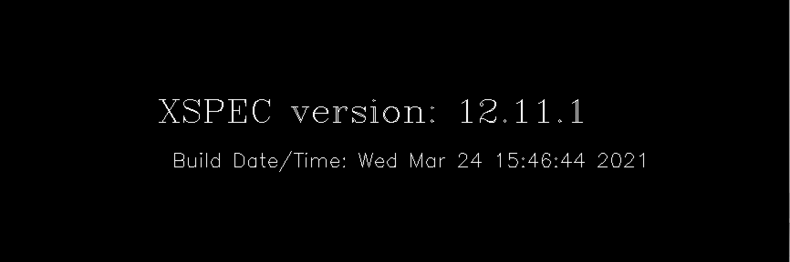
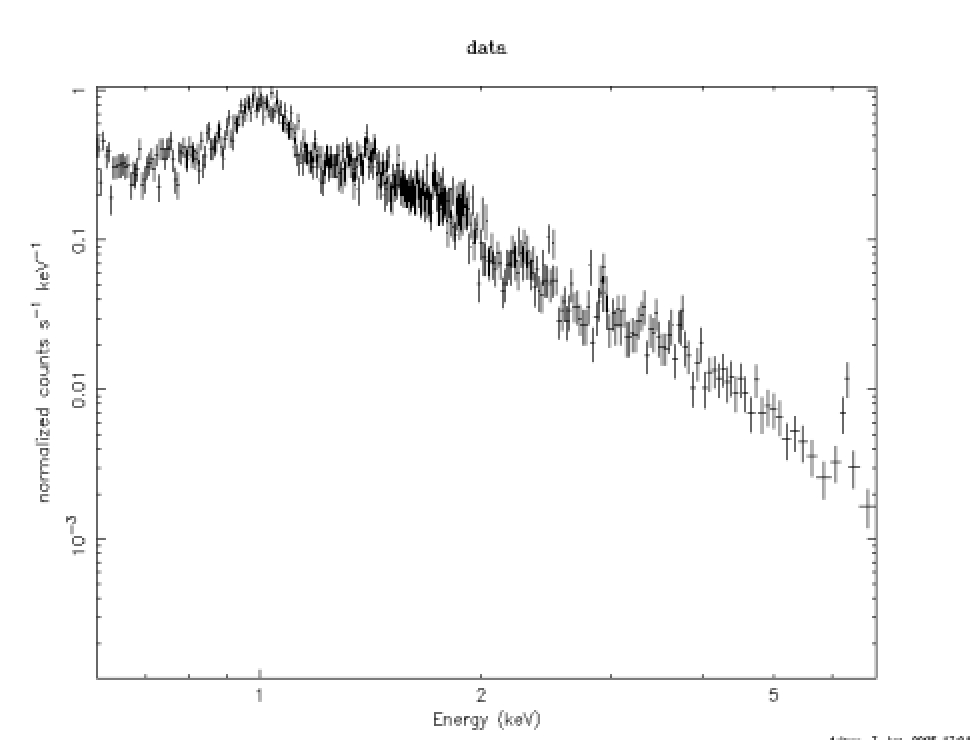
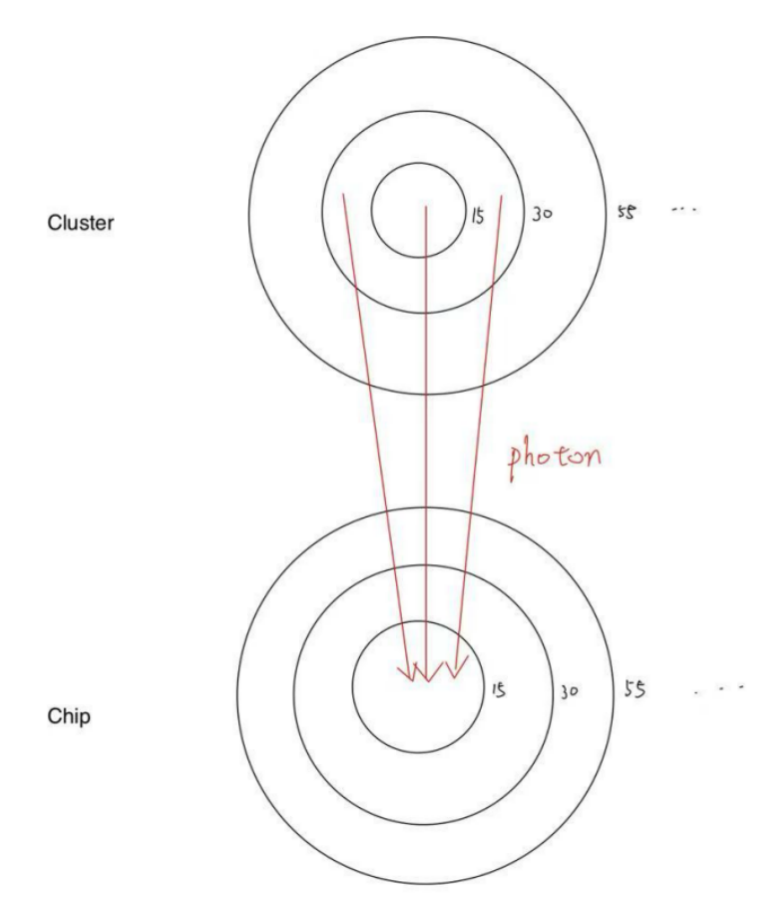
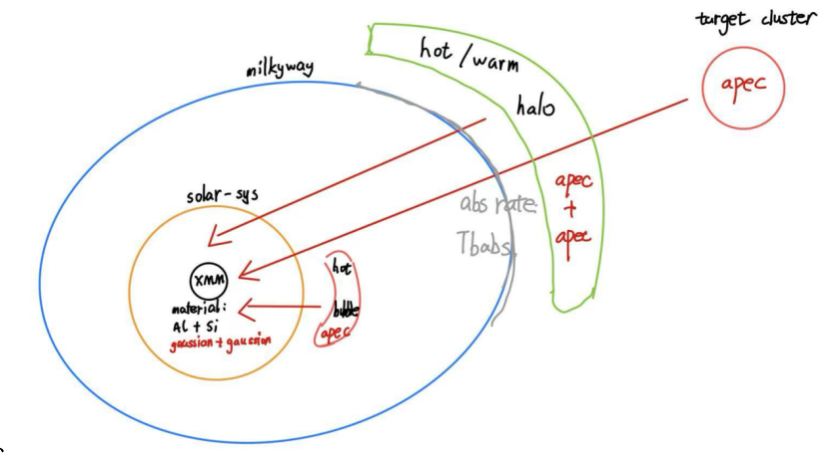
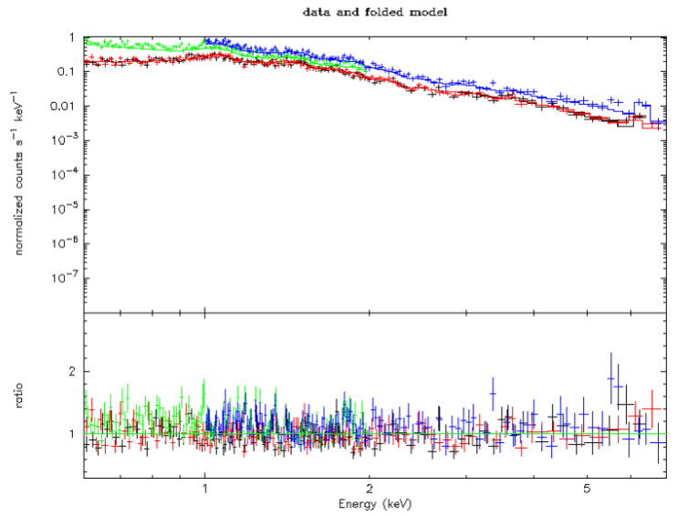

# XSPEC Instruction

Welcome! This handbook will help you with basic commands in spectrum fitting in Xspec.

## Table of steps

- [1. Introduction and preparation](# 1. Introduction and preparation)

- [2. Environment setups](#2. Environment setups)

- [3. Initializing Xspec](# 3. Initializing Xspec)

- [4. Basic commands for Xspec](#4. Basic commands for Xspec)

- [5. XCM files and composition](#5. XCM files and composition)

- [6. Fitting process](#6. Fitting process)

- [7. Xspec data control commands](#7. Xspec data control commands)

  

## 1. Introduction and preparation

​	XSPEC is a software tool developed by NASA for analyzing astronomical data, particularly X-ray spectra. It helps scientists understand astrophysical phenomena by modeling and fitting observed data with  theoretical models. 

​	To use XSPEC, we use ssh key to access XSPEC in Lang direction. The Lang directory is located at our central computer server, includes data files, response files, background files, and model scripts. We use XSPEC here because this directory is well-organized and has enough space for running spectral fits, saving outputs, and testing different models. Also, downloading XSPEC takes a long time, using it through Lang could help us avoiding the painful installation.

Here are two necessary preparations to do before starting:

1. Email [LSATechnologyServices@umich.edu](mailto:LSATechnologyServices@umich.edu) to create our own direction in Lang

2. Download XQuartz: https://www.xquartz.org/ and SAOImage DS9: https://sites.google.com/cfa.harvard.edu/saoimageds9/download

3. Every log in should be done in UofM wifi environment, here is the link for official vpn: https://safecomputing.umich.edu/protect-yourself/be-safe-online/secure-connection

   

## 2. Environment setups

1. Open the **terminal** application on your laptop.

   ```bash
   wudaocheng@wudaochengdeMacBook-Pro ~ %
   ```

2. Type ***ssh -XY* [*dchwu@lang-sas-vm.astro.lsa.umich.edu*](mailto:dchwu@lang-sas-vm.astro.lsa.umich.edu)**

   ```bash
   wudaocheng@wudaochengdeMacBook-Pro ~ % ssh -XY dchwu@lang-sas-vm.astro.lsa.umich.edu
   ```
   
   a. You’ll be prompted to enter “yes” (not all the time), and then your uniquename password
   
   ```bash
   dchwu@lang-sas-vm.astro.lsa.umich.edu's password: 🔑
   ```

​	b. This will give you access to Joel’s Lang computer from your laptop. 

3. Navigate into your folder: ***cd /nfs/Lang2/dchwu***

   ```bash
   dchwu@lang-sas-vm:~$ cd /nfs/Lang2/dchwu/
   ```

​	a. This is your home directory on Lang. 

​	b. Our files all stored in this direction 

4. Some basic commands:

   a. ***cd*** will bring you into a directory

    ```bash
   dchwu@lang-sas-vm:/nfs/Lang2/dchwu$ cd a1991/
   dchwu@lang-sas-vm:/nfs/Lang2/dchwu/a1991$ 
    ```

   b. ***cd ..*** will bring you out of the directory you are in

    ```b
   dchwu@lang-sas-vm:/nfs/Lang2/dchwu/a1991$ cd ..
   dchwu@lang-sas-vm:/nfs/Lang2/dchwu$ 
    ```

   c. ***ls*** will list the files/folders in the directory you are in

   ```bash
   dchwu@lang-sas-vm:/nfs/Lang2/dchwu$ ls
   a1991  A2259_bkgfiles  A2259_practice
   ```

5. Moving files from Lang to your laptop and vice-versa:

   These commands only work in your computer’s **original direction**

   a. Lang to your laptop

   ```bash
   wudaocheng@wudaochengdeMacBook-Pro ~ % scp -r dchwu@lang-sas-vm.astro.lsa.umich.edu:/path/to/directory/file /Path/on/your/computer/
   ```

   b. Your laptop to Lang

   ```bash
   wudaocheng@wudaochengdeMacBook-Pro ~ % scp -r /Path/on/your/computer/file dchwu@lang-sas-vm.astro.lsa.umich.edu:/path/to/directory/
   ```


## 3. Initializing Xspec

1. **Get acquainted with the different spectra and Xspec:**

   a. Initialize heasoft with ***heainit*** (this step might not needed)

   b. Open xspec (the spectral fitting software) with ***xspec***

   ```bash
   dchwu@lang-sas-vm:/nfs/Lang2/dchwu$ xspec
   
   		XSPEC version: 12.11.1
   	Build Date/Time: Wed Mar 24 15:46:44 2021
   
   XSPEC12>
   ```

​	Once these messages are printed , xspec is successfully set up.


## 4. Basic commands for Xspec

1. Load in sepctrums with ***data n:n [name of the srepctrum file]***

   ```bash
   XSPEC12>data 1:1 mos1S001-obj-15-grp15.pi 
   1 spectrum  in use
   Spectral Data File: mos1S001-obj-15-grp15.pi  Spectrum 1
   ...
   ```

   ```bash
   XSPEC12>data 2:2 mos2U002-obj-15-grp15.pi 
   2 spectra  in use
   Spectral Data File: mos2U002-obj-15-grp15.pi  Spectrum 2
   ...
   ```

2. Ignore ranges with ***ignore n:[range of being ignored]*** 

   ```bash
   XSPEC12>ignore 1:0-0.6,7.0-**
      102 channels (1-102) ignored in spectrum #     1
      577 channels (490-1066) ignored in spectrum #     1
   ```

   ```bash
   XSPEC12>ignore 2:0-0.2,1-**
       20 channels (1-20) ignored in spectrum #     2
      728 channels (1,728) ignored in spectrum #     2
   ```

3. Plot the spectrum

   a. Initialize the plotting software: ***cpd /xs***

   ```bash
   XSPEC12>cpd /xs
   XSPEC12>
   ```

   The plotting board will be called out:

   

   b. Plot with energy on the x-axis: ***setplot energy***

   ```bash
   XSPEC12>setplot energy
   XSPEC12>
   ```

   c. Plot the data in log form: **plot ld**

   ```bash
   XSPEC12>plot ld
   XSPEC12>
   ```

   

   ​    		  Above is the picture that you might see

   d. Load in and plot other data sets will be displayed with the first one at the same time.

   ​    Here is the color related to spectrum index:

   ​	i.    1 = black 

   ​	ii.   2 = red

   ​	iii.  3 = green

   ​	iiii. 4 = blue….and so on

   ​	

## 5. XCM files and composition

​	An ***XCM*** file is a command script used in the spectral fitting software XSPEC (X- ray Spectral Fitting Package). It allows users to save and reload the entire XSPEC fitting session, including the loaded data files, defined models, parameter values, frozen/thawed states, and plotting settings. 

The name of the file is in this format:  ***0-15_apec.xcm***

Here is the composition of XCM files:

- [1. Loaded spectrums](# 1. Loaded spectrums)
- [2. arf files and response files](# 2. arf files and response files)
- [3. Model setups](# 3. Model setups)
- [4. Model components and parameters ](# 4. Model components and parameters)

### 1. Loaded spectrums

The first component is spectrums and ignore useless regions, which is the same format as above:

```bash
data 1:1 mos1S001-obj-15-grp15.pi
data 2:2 mos2U002-obj-15-grp15.pi
data 3:3 pnS003-obj-os-15-soft-grp15.pi
data 4:4 pnS003-obj-os-15-hard-grp15.pi
...
ignore 1: 0-0.6,7-**
...
```

### 2. arf files and response files

The second part are arf and response files, which are:

```bash
response  2:1 mos1-diag.rsp.gz
response  14:1 mos1S001-15.rmf
arf 1:1 mos1S001-0-15-0-15.arf
arf 14:1 mos1S001-15-30-0-15.arf     //These 4 lines for data group 1
...
```

**RMF (Redistribution Matrix File)**: Tells XSPEC how the detector redistributes photon energies into different channels.

**ARF (Ancillary Response File)**: Tells XSPEC the effective area (sensitivity) of the detector at different photon energies. As below, photon from different area in cluster might hit on the chip tends to detect one determined area:



**RSP.GZ:** The combination of RMF and ARF. It can be downloaded from website, but not as accurate as inputing the 2 files separately

### 3. Model setups

After inserting all necessary files, next step is to set up the model:

```bash
statistic chi
method leven 5000 0.01
abund aspl
xsect bcmc
cosmo 70 0 0.73
xset delta -1
systematic 0
```

These setup commands are pre-condition for the model we construct, here we define statistic type, fitting method, abundance standard... 

### 4. Model components and parameters

The next thing is the model it self:

```bash
model  //After typing *model*, xspec will ask us to set model components
gaussian + gaussian + constant*constant(gaussian + gaussian + apec + (apec + apec + powerlaw)TBabs + apec*TBabs)
```

This model is an example of galaxy cluster out side of our local galaxy in a small redshift.

The model components here are gaussian, apec, TBabs. Here is the explanation for each one:

**Gaussian Model**

- **Purpose**: Fits emission or absorption lines for a single element in spectra.

- **Parameters**:

  - **LineE**: Central line energy (keV).

  - **Sigma**: Line width (keV).

  - **norm**: Line intensity (normalization) 

    ```bash
    //Below is the parameters in xcm files, Gaussian model has 3 related parameters
    1.496        -0.05          0          0      1e+06      1e+06  //LineE
    3.74266       0.05          0          0         10         20  //Sigma
    0.000209406   0.01          0          0      1e+24      1e+24  //Norm
    ```

**APEC Model (Astrophysical Plasma Emission Code)**

- **Purpose**: Models emission spectra from hot, collisionally-ionized plasma with multiple elements.

- **Parameters**:

  - **kT**: Plasma temperature (keV).

  - **Abundance**: Elemental abundance (relative to solar).

  - **Redshift**: Redshift value.

  - **norm**: Plasma emission measure (intensity).

    ```bash
     //A group of 4 parameters for each apec model
     1       -0.01          0          0      1e+10      1e+10   //Kt
     2.226   -0.01          0          0      1e+10      1e+10   //Abundance
     0.56    -0.05          0          0      1e+06      1e+06   //Redshift
     0       -0.05          0          0         10         20   //Norm
    ```

    

**TBabs Model (Tuebingen-Boulder absorption model)**

- **Purpose**: Absorption rate of local galaxy of X-ray spectra.

- **Parameters**:

  - **nH**: Hydrogen column density, which is a constant.

    ```
    0.0288      -0.01          0          0         10         10 //a constant
    ```

    

 


A short explanation for why we built the model with these 2 lines of component models:

X-ray from the **galaxy we observe (apec)** cross **local hot and warm halos (apec + apec)**, partly absorbed by **local galaxy (TBabs)**, finally arrived our instrumental detector together with the X-ray from solar systems **hot bubble (apec)**. The detector is made mainly by **Al and Si (gaussian + gaussian)**.

For information of more model components, visit here: https://heasarc.gsfc.nasa.gov/xanadu/xspec/manual/Models.html

## 6. Fitting process

Fitting starts with xcm files. We can either type the xcm components line by line, or simply use ***@name of .xcm file*** to input the file into xspec directly.

```bash
XSPEC12>@0-15vapec.xcm 
...
Test statistic : Chi-Squared                 3218.96     using 2415 bins.
 Null hypothesis probability of 5.96e-30 with 2356 degrees of freedom
 Current data and model not fit yet.
XSPEC12>
```

To start fitting, use command: ***fit*** or ***fit*** + ***number of interactions***

```bash
XSPEC12>fit 5000  //5000 iterations of fits
...
Test statistic : Chi-Squared                 3218.96     using 2415 bins.
 Null hypothesis probability of 5.96e-30 with 2356 degrees of freedom
XSPEC12>
```

Fitting process finishes here.

## 7. Xspec data control commands

After finishing fitting process, there are several commands to control the parameters in model components 

1. ***show par*** to show all parameters and models

   ```bash
   XSPEC12>show par
   
   Parameters defined:
   ========================================================================
   Model gaussian<1> + gaussian<2> + constant<3>*constant<4>(gaussian<5> + gaussian<6> + apec<7> + (apec<8> + apec<9> + powerlaw<10>)TBabs<11> + vapec<12>*TBabs<13>) Source No.: 1   Active/On
   ...
   ```

2. ***freeze n*** to freeze parameter with index n from fitting

   ```bash
   XSPEC12>freeze 2
   ...
    Null hypothesis probability of 6.97e-30 with 2357 degrees of freedom
    Current data and model not fit yet.
   XSPEC12>
   ```

3. ***thaw n*** to thaw a freezed parameter with index n

   ```bash
   XSPEC12>thaw 2
   ...
    Null hypothesis probability of 5.96e-30 with 2356 degrees of freedom
    Current data and model not fit yet.
   XSPEC12>
   ```

4. ***new par n m*** to reset the parameter with index n into value m

   ```bash
   XSPEC12>newpar 2 1  //sign 1 to parameter 2
   ...
    Null hypothesis probability of 1.24e-38 with 2356 degrees of freedom
    Current data and model not fit yet.
   XSPEC12>
   ```

5. ***plot ld rat*** to show the image and residual together

   ```bash
   XSPEC12>plot ld rat
   ...
   ```

   

   The image looks like this in the plotting board.

​    
